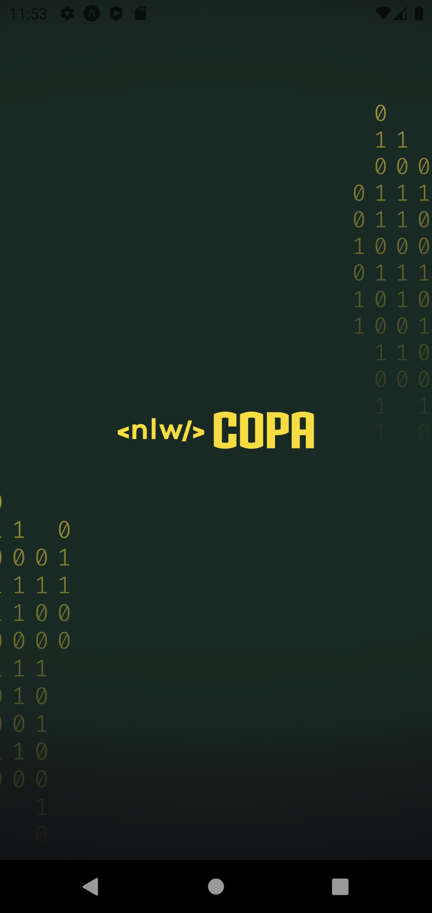
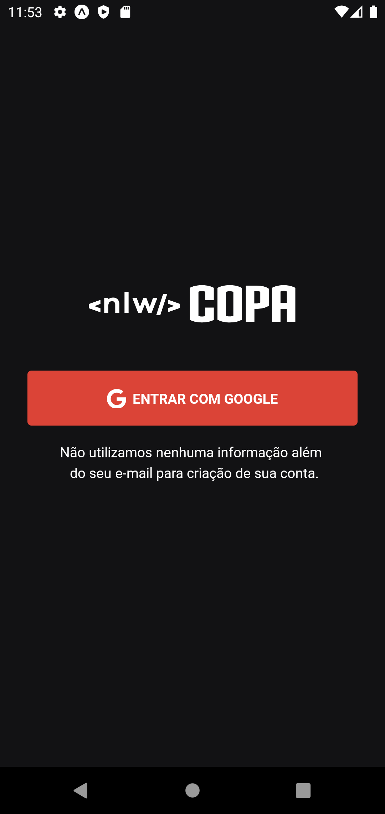
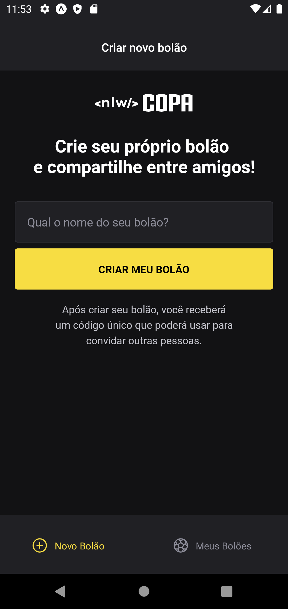
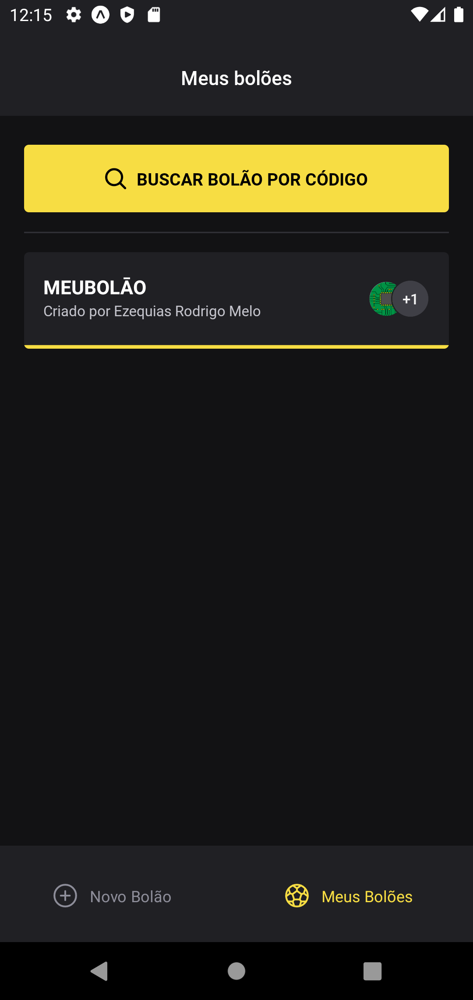
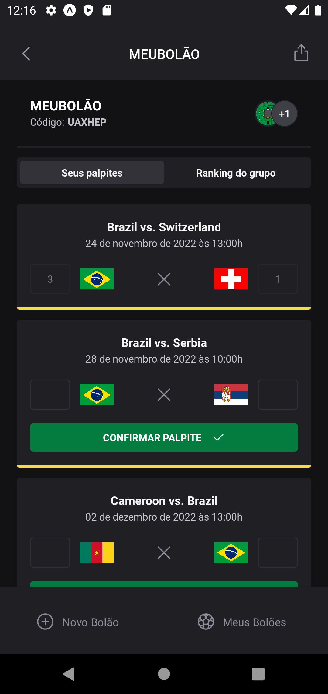

# NWL Copa

## 💻 Projeto

Aplicação para participar de bolões da Copa do Mundo 2022,
desenvolvido durante a semana Next Level Week (NLW) na Trilha Ignite promovido pela
<a href="https://www.rocketseat.com.br/">Rocketseat</a>.

## ✨ Tecnologias

- [TypeScript](https://www.typescriptlang.org/)
- [React](https://reactjs.org/)
- [Next.js](https://nextjs.org/)
- [React Native](https://reactnative.dev/)
- [Expo](https://expo.dev/)
- [Node.js](https://nodejs.org/en/)
- [Fastify](https://www.fastify.io/)
- [Prisma](https://www.prisma.io/)
- entre outras...

## 🔖 Telas

    
    
    
    
    

